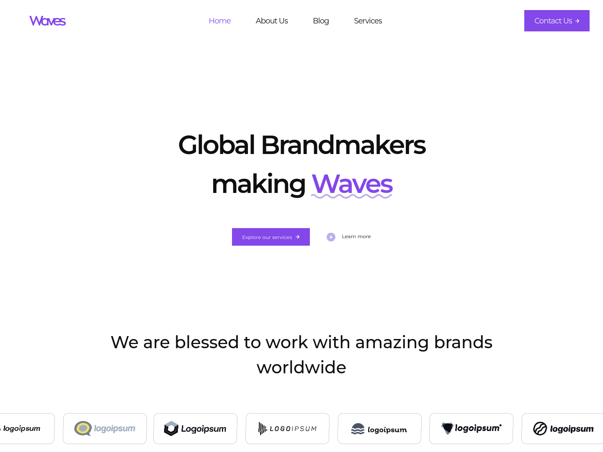
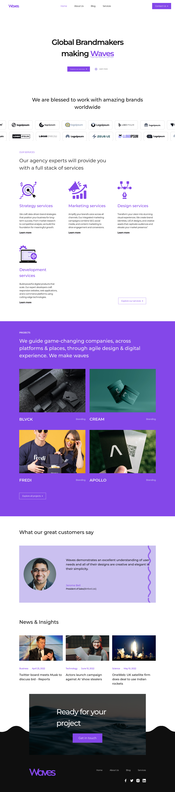
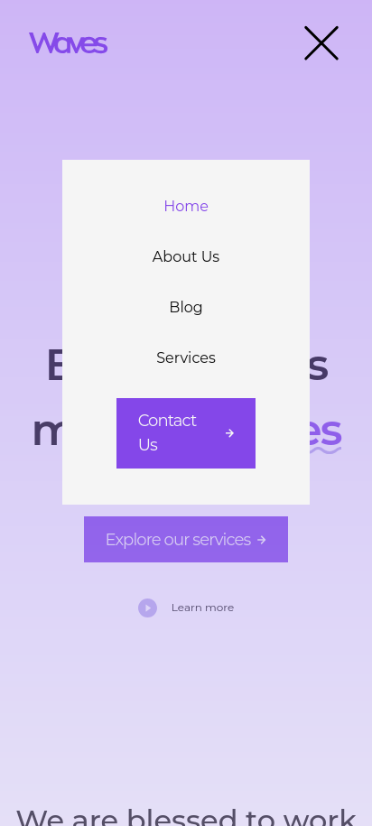
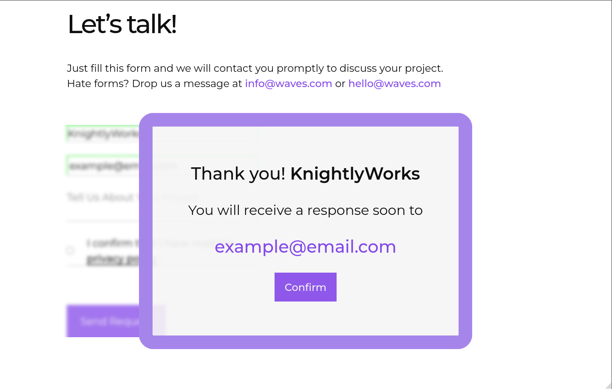

# 🌊 Waves - Brand Agency Landing Page

Modern, responsive landing page for a creative agency. Built from desktop-only Figma design with custom animations and working contact form.

**[→ View Live Demo](https://agencywaves.netlify.app/)**

---

## 🎯 The Challenge

Started with a desktop-only Figma design. Created a fully responsive website that works on all devices with smooth animations and real functionality.
**Timeline:** 4 days

**What I Added:**

- Mobile & tablet layouts (original design was desktop-only)
- Scroll animations and hover effects
- Working contact form with smart validation
- Performance optimizations

---

## ✨ Features

### Responsive Design

Adapted desktop design to work seamlessly on mobile and tablet. Created custom mobile navigation with smooth slide-in menu.

### Smooth Animations

Elements fade in and slide as you scroll (disabled on mobile for better performance). Cards lift and glow on hover.

### Smart Contact Form

- Real-time validation that doesn't annoy users
- Shows errors only after you finish typing
- Character counter: "Add 5 more characters"
- Integrated with Netlify - no backend needed
- Personalized success message

### Performance

- Fast loading with minimal JavaScript
- Optimized images with lazy loading
- SEO-ready semantic HTML

---

## 🛠️ Built With

- **Tailwind CSS** - Fast styling, easy responsiveness
- **Alpine.js** - Lightweight interactivity (15kb)
- **AOS** - Scroll animations
- **Netlify Forms** - No backend needed
- **esbuild** - Fast modern build tool

---

## 💡 Key Decisions

**Animations disabled on mobile**  
Prevents scroll bugs and improves performance. Mobile users want speed over visual effects.

**Single testimonial vs carousel**  
One strong testimonial is more impactful than three average ones. Cleaner look, better performance.

**Validation on blur, not while typing**  
Errors appear after you leave the field, not while you're still typing. Feels helpful, not annoying.

---

## 📸 Screenshots

### Desktop

_Full responsive layout with scroll animations_

### Mobile

_Smooth slide-in navigation menu_

### Form Success

_Personalized confirmation with user details_
